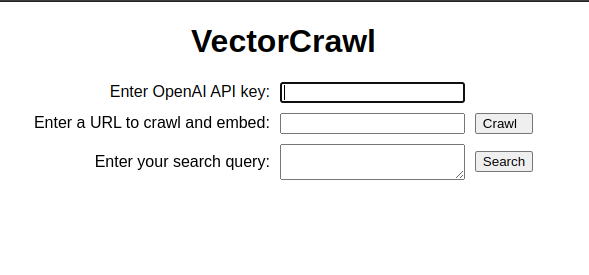

# VectorCrawl

Welcome to VectorCrawl, an open source software project that empowers you to search and explore the web in a semantically rich and efficient way. By combining web crawling, text extraction, and embedding techniques, VectorCrawl enables you to find the most relevant documents for your queries in no time.

With VectorCrawl, you simply provide a URL and let the app do the heavy lifting. It crawls the URL and associated pages, extracts the text content, and feeds it to an embedding model. The resulting vectors are stored in a vector database (e.g., Pinecone), providing an optimized and easily searchable index of the web content.

When you have a query, just enter it into VectorCrawl. The app will embed your query, find the k-nearest vectors in the database, and retrieve the most relevant documents for you.

Discover the power of semantic search with VectorCrawl, and unlock a world of highly relevant and easily accessible web content!

#### Screenshot:

